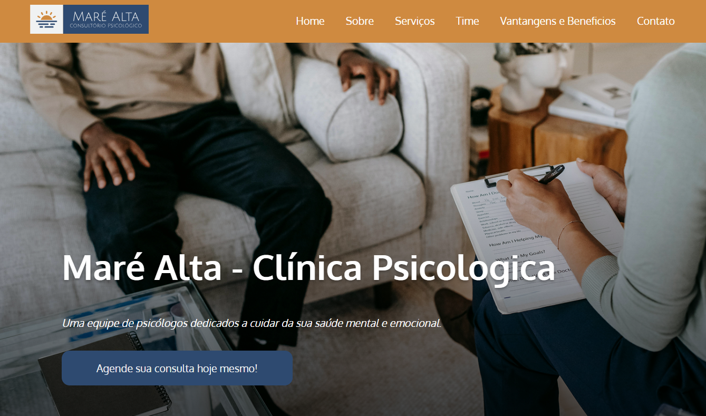

# Clínica Psicológica Maré Alta  

## 📌 Contexto do Projeto  
Trabalho acadêmico desenvolvido para a disciplina de **Web Standards** do curso de Análise e Desenvolvimento de Sistemas do Centro Universitário Senac.  

## 🌐 Demonstração Online  
Acesse a página publicada: `https://uber-sleep.github.io/webstandarts_pti/`  

## 🎯 Objetivo Principal  
Desenvolver uma landing page responsiva para pequena empresa de acordo com as instruções:  
- Uso exclusivo de **HTML5 semântico** e **CSS3 puro**  
- Implementação de layouts com **Flexbox**  
- Design **100% responsivo** (mobile-first)  
- Proibição de frameworks (Bootstrap, Tailwind, etc.)  

## 💻 Detalhes Técnicos  

### 🛠 Stack Utilizada  
- **HTML5**: Estrutura semântica com 6 seções  
- **CSS3**:  
  - Flexbox para layouts responsivos  
  - 3 breakpoints (480px, 725px, 1025px)  
  - Variáveis CSS para cores e tamanhos  
- **Recursos Externos**:  
  - Bootstrap Icons (via CDN)  
  - Google Fonts (Oxygen)  

### 📐 Arquitetura CSS  
- Organização em 3 camadas:  
  1. `reset.css` - Normalização  
  2. `style.css` - Estilos principais  
  3. `media.css` - Responsividade  

## ▶️ Como Executar  
    1. Baixe os arquivos  
    2. Abra `index.html` no navegador  
    3. Teste em diferentes tamanhos de tela  

## 🔄 Melhorias Futuras  
- Menu mobile  
- Validação com JavaScript  

---  
*Desenvolvido por Carolina Gonçalves - 2025*  
